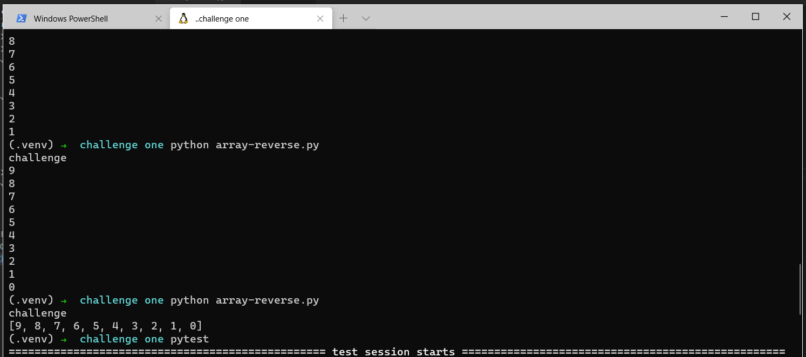

# Reverse an Array
<!-- Short summary or background information -->
take a certain array and process it to produce a new array with exact entries but in reversly.

## Challenge
<!-- Description of the challenge -->
We have been asked to not use any built-in method. So, we need to use oyr logic

## Approach & Efficiency
<!-- What approach did you take? Why? What is the Big O space/time for this approach? -->
it taked 30 min

## Solution
<!-- Embedded whiteboard image -->
